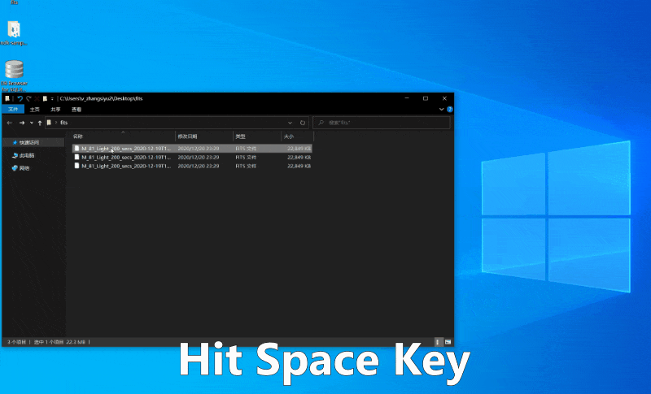

# QuickLook.Plugin.FitsViewer

FITS image Plugin for QL-win, featuring 
- auto debayer if needed
- auto stretch, producing similar image as PI
- FITS header available via the little info icon on the top-right corner

## Demo

## Typical usecases
* in the field: experiment exposure/gain combination 
* post: primary sub rejection for things like satelite trails and bad tracking

## Install
A short video demo & instruction is available [here](https://youtu.be/oMexMV3Yx3E)
1. Download and run QuickLook for windows [here](https://github.com/QL-Win/QuickLook)
2. Grab the latest [release file](https://github.com/siyu6974/QuickLook.Plugin.FitsViewer/releases/)
3. Find the file you just downloaded in the File Explorer, for example "QuickLook.Plugin.FitsViewer.qlplugin"
4. Select it and then hit the space key, click "click here to install this plugin"
5. Restart QuickLook (find the icon on the system tray, right-click Quit, and relaunch) / or just restart your PC
6. Enjoy, try hit the space key on a FITS file

You can also find the mac version [here](https://apps.apple.com/us/app/quickfits/id1551075981?mt=12)  

## Known issues
The plugin will crash if
- the file path contains non ASCII characters (wstring on Windows is a pain)
- the FITS file does not contain an image, e.g. scientific table form data or spectogram. Hubble image can be opened though

I spent days trying to have these fixed or at least fail gracefully but due to limitations of the plugin, I was unable to do so. PR welcomed if you have any ideas.

## Develop
The plugin contains serveral layers like an onion 

Plugin DLL (C#) - viewer_core (C++) - CCFits/cfitsio (C++/C)

The viewer_core is a C++ DLL that 
1. Calls CCfits (which depends on cfitio, of course) to read FITS files
2. Debayers the image using super pixel algorithem
3. Applys auto-stretching

The Standalone viewer WPF project is mainly for debug purpose, its files are *copy-pasted* from/to the main plugin project.

To build a plugin that works with both x86 and x64 arch, be sure to use `batch build` under the `Build` tab in VS. Then run `pack-zip.ps1` under `Script`. 

*Note*

Before the first build, if not already done, run `Set-ExecutionPolicy -ExecutionPolicy RemoteSigned` within admin-level powershell.

Before releasing, make sure to tag the release as `pack-zip.ps1` uses the Git tag to create a reversion number.

## Debug

The inner view_core as a DLL can't print anything to the terminal so I made a logging utility that logs to `~\Documents\QuickFITS.log`. To use it, merge the `ENABLE_LOGGING` branch. 

## License

The source of this project is released under LGPL License.

It uses third party libraries and code released under their repective licenses, namely

- CCfits: [link](https://github.com/esrf-bliss/CCfits/blob/master/License.txt)
- cfitsio: [link](https://github.com/healpy/cfitsio/blob/master/License.txt)
- QuickLook: GPL3.0

